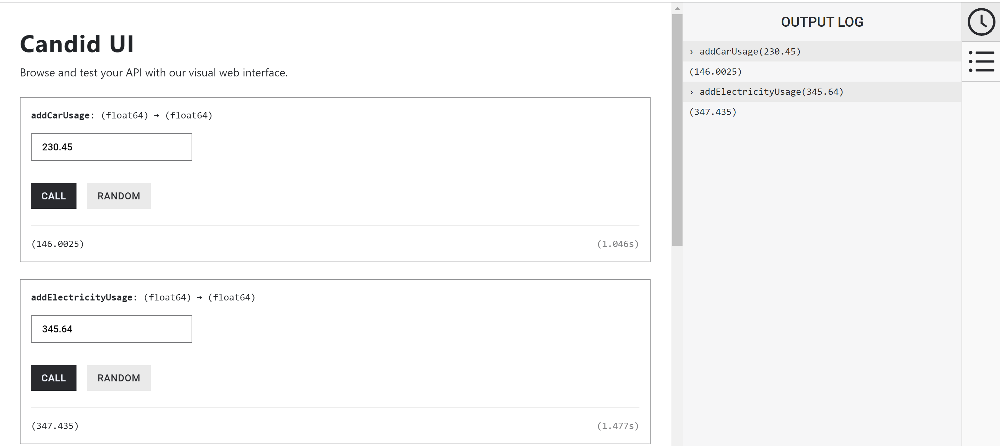
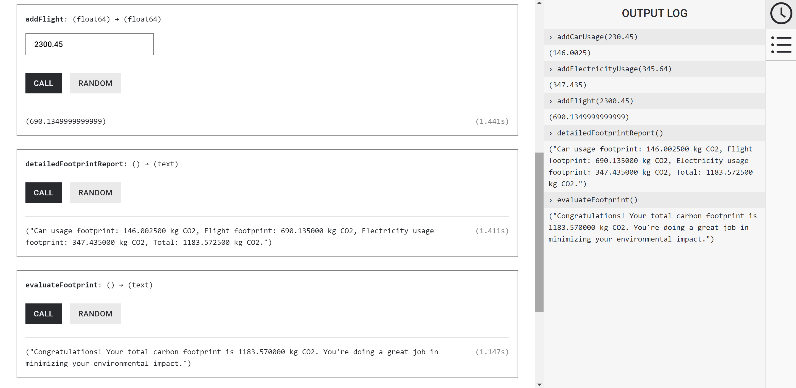
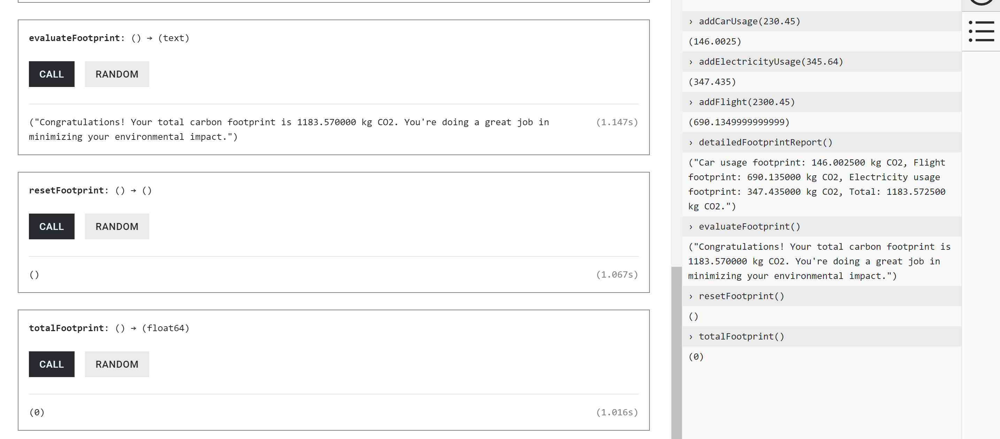

# Carbon Footprint Calculator

This project calculates your total carbon footprint based on car usage, flight distance, and electricity consumption. It provides an individual carbon footprint for each category and a total footprint, helping users track and minimize their environmental impact.

## Features
Calculate carbon emissions from:
- Car usage (in km)
- Flights (in km)
- Electricity consumption (in kWh)
- Display individual footprints for each category.
- Provide a total carbon footprint with suggestions based on the result.
- Clear footprints for new calculations.

## Screenshots

Here are some screenshots from the project:

